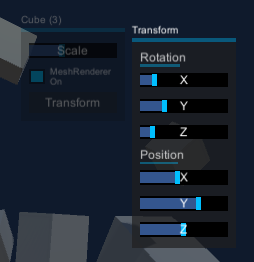

# ContextMenu for Unity3D

ContextMenu was designed as a universal solution providing easy way to script UI popup menu creation, in a trivial and robust manner. Using it you only define the business logic of your context menu, without worrying aobut the presentation / UI Layer - you only declare the type of control to instantiate (with optional style hind) and attach event listener methods in a typical Unity3D manner. ContextMenu handles the rest (user input, UI item instantiation, and destruction). This lets you add functional business logic with to your 3D and 2D objects with only tiny, portable, dependency free snippets.

## IContextMenu

At the root of ContextMenu lies IContextMenu interface. An object needs to be raycastable for UI, or have a Collider for 3D.  Context menu will be displayed if an object, that has any scripts implementing IContextMenu. Context menu will handle requesting all the prefabs from prefab provider, and provides your impementation with a proxy tool (PrefabProxy) that handles object instantation and placement.

An exmple implementation looks like this:

```
    public void BuildContextMenu(PrefabProxy prefabs)
        {
              prefabs.GetLabel("This is a sample");
              prefabs.GetButton("Hello World").onClick.AddListener(()=>{ 
                          Debug.Log ("Hello world callback");
                          });
        }
```

You can have multiple script implementing IContextMenu attached to your gameobject, they will all get their chance to add their controls and push them to the same container panel.

## Nested Menus



There are two ways to create nested menus using ContextMenu. If you want a button click to open another menu, you can use GetNestedButton method, defined in the extensions. When such button is clicked, ContextMenu creates another panel on top of existing view, and calls your method with a fresh PrefabProxy  (for example:)

```
	prefabs.GetNestedButton("SubMenu",(submenu)=>{
        submenu.GetButton("ButtonA");
        submenu.GetButton("ButtonB");
        submenu.GetButton("ButtonC"); // add callbacks
    });

```

Alternatively, if you want to handle right click within a menu, there's also an easy way for that. To do so, add a script implementing IContextMenu, to your item, after requesting them from PrefabProxy. Normally right click will close current submenu level, but if topmost object under cursor also implements IContextMenu, this behaviour is overridden and new context menu is created

More examples are in the NestedExample.cs class and ContextMenuTransform.cs
NestedExample adds a button using both those ways - providing one menu on normal click, and another (self reference) on right click.

## Prefab Provider

A generic InstantiatePrefab method is placed in a seperate class, because there's various approaches to how you want to create your items. For me, a likely candidate for integration is [SyncPalette](https://github.com/zambari/SyncPalette.Unity), but I wanted the core Context Menu to be clear of dependencies, so it is not included. Instead, bundled with ContextMenu is a class called SimplePrefabProvider, with slots for prefabs of each type. 

An InstantiatePrefab call can be supplied with optional 'style' parameter, with which you can hint your Prefab Provider of the variant of the prefab you need, for example for texts I would often need larger 'Header' text, and smaller 'label' text. If no matching style is found, a default object of a given type shall be returned (in case you move project and have different styles defined in it)


## Preparation

ContextMenu needs minimal setup. Place the script on an image at the root of your canvas, preferably at the bottom most position in the hierarchy (last sibling). The only preparations needed is creating prefabs for basic UI element types   Button, Text, Slider, Toggle (which need to have Layout Element with preffered heights set), and a special type called Panel, which is basically a RectTransform, with VerticalLayoutGroup and ContentSizeFitter (so that your items get nicely aligned).

It is also recommended that your Panel prefab has a Button with no function - otherwise clicks in between controls get through to the backround blocker object and result in closing the menu.

If you want 3D objects to have context menus - remember to place PhysicsRaycaster on your camera!


## Compatibility

Code should be compatible across the board of unity versions. Example scene has been prepared using Unity 2017.4 for thos of you who still use it

For mobile devices (which inherently dont have right click events) context menu can be opened by pressing and holding on an object for a given time. This may get in the way of some other actions on your scene so is by default disabled;

## PrefabProxy

Prefab Provider tool is a proxy object, that holds a transform reference - it provides local context - a transform to which newly spawned controls will be parented.  Details bridging ProviderTool to a generic Instantiate call from PrefabProvider with specific type requested are defined as extension methods thus are easy to expand in a consistent manner
